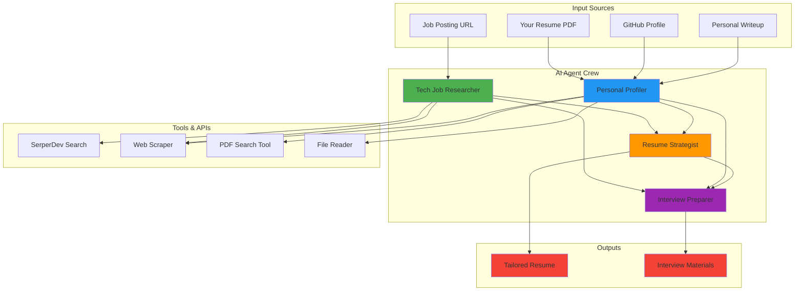
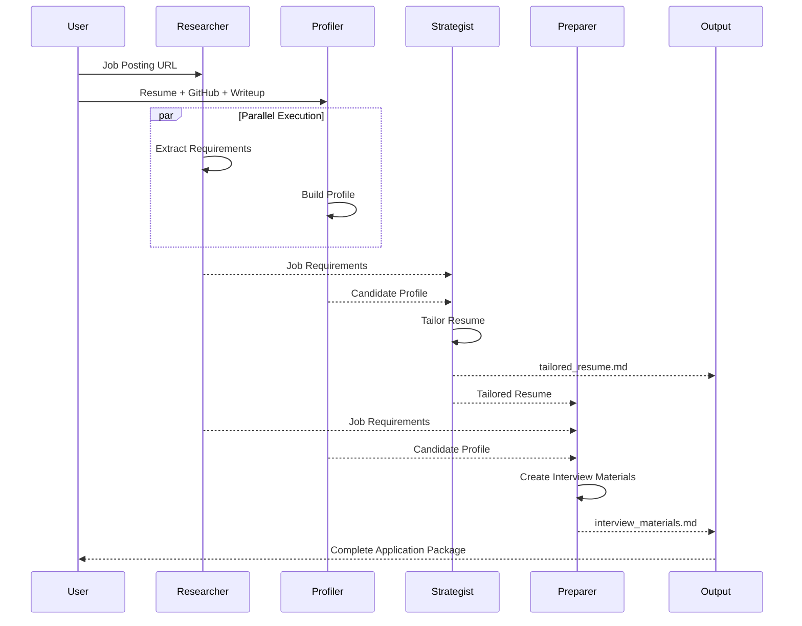
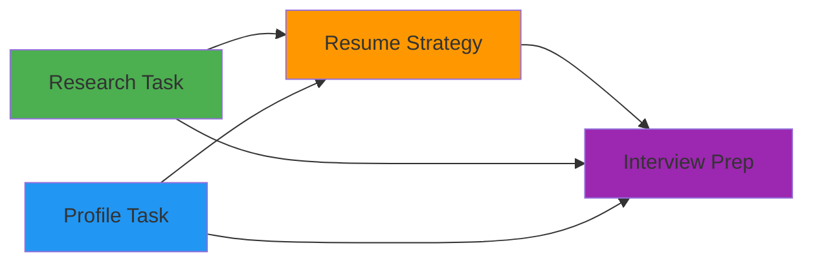

# 🎯 Agentic Job Hunter

An intelligent multi-agent system that revolutionizes job applications by automatically tailoring resumes and preparing interview materials using AI agents powered by CrewAI.


## 📋 Table of Contents

- [Overview](#overview)
- [Features](#features)
- [Architecture](#architecture)
- [How It Works](#how-it-works)
- [Installation](#installation)
- [Configuration](#configuration)
- [Usage](#usage)
- [Agents & Their Roles](#agents--their-roles)
- [Output Examples](#output-examples)
- [Project Structure](#project-structure)
- [Best Practices](#best-practices)
- [Contributing](#contributing)
- [License](#license)

## 🎯 Overview

**Agentic Job Hunter** is an AI-powered job application assistant that uses four specialized AI agents working in harmony to:

- 🔍 **Analyze** job postings to extract key requirements
- 👤 **Profile** candidates using their GitHub and personal information
- 📄 **Tailor** resumes to perfectly match job requirements
- 💼 **Prepare** comprehensive interview materials and talking points

Say goodbye to generic resumes and hello to personalized, ATS-optimized job applications that stand out!

## ✨ Features

### 🤖 Four Specialized AI Agents

1. **Tech Job Researcher** - Extracts and analyzes job requirements
2. **Personal Profiler** - Creates comprehensive candidate profiles
3. **Resume Strategist** - Tailors resumes to match specific roles
4. **Interview Preparer** - Generates interview questions and talking points

### 🛠️ Advanced Capabilities

- ✅ **PDF Resume Analysis** - Semantic search through your CV
- ✅ **Web Scraping** - Extracts data from job postings and GitHub
- ✅ **Async Execution** - Parallel processing for faster results
- ✅ **Context-Aware Tasks** - Agents build on each other's work
- ✅ **File Output** - Generates ready-to-use markdown files
- ✅ **ATS Optimization** - Ensures resumes pass Applicant Tracking Systems

## 🏗️ Architecture



## 🔄 How It Works

### Workflow Sequence



### Task Dependencies



## 🚀 Installation

### Prerequisites

- Python 3.11 or higher
- OpenAI API key
- Serper API key (for web search)
- Your resume in PDF format

### Step-by-Step Setup

1. **Clone the repository**
   ```bash
   git clone https://github.com/iitsh/Agentic-Job-Hunter.git
   cd Agentic-Job-Hunter
   ```

2. **Create a virtual environment**
   ```bash
   python -m venv venv
   source venv/bin/activate  # On Windows: venv\Scripts\activate
   ```

3. **Install dependencies**
   ```bash
   pip install crewai crewai-tools python-dotenv jupyter
   ```

4. **Set up your API keys**
   ```bash
   cp .env.example .env
   # Edit .env and add your API keys
   ```

5. **Add your resume**
   ```bash
   # Place your CV as YOUR_CV.pdf in the root directory
   ```

## ⚙️ Configuration

### Environment Variables

Create a `.env` file with your API keys:

```env
OPENAI_API_KEY=your_openai_api_key_here
SERPER_API_KEY=your_serper_api_key_here
```

### Get Your API Keys

- **OpenAI API Key**: [platform.openai.com](https://platform.openai.com/api-keys)
- **Serper API Key**: [serper.dev](https://serper.dev/)

## 📖 Usage

### Running the Jupyter Notebook

```bash
jupyter notebook L7_job_application_crew.ipynb
```

### Programmatic Usage

```python
from crewai import Agent, Task, Crew
from utils import get_openai_api_key, get_serper_api_key
import os

# Set up environment
openai_api_key = get_openai_api_key()
os.environ["OPENAI_MODEL_NAME"] = 'gpt-4-turbo'
os.environ["SERPER_API_KEY"] = get_serper_api_key()

# Define your inputs
job_application_inputs = {
    'job_posting_url': 'https://example.com/job-posting',
    'github_url': 'https://github.com/yourusername',
    'personal_writeup': '''
        I am a passionate software engineer with 5 years of experience
        in full-stack development, specializing in Python and React...
    '''
}

# Run the crew
result = job_application_crew.kickoff(inputs=job_application_inputs)
```

### Input Parameters

| Parameter | Description | Example |
|-----------|-------------|---------|
| `job_posting_url` | URL of the job posting | `https://company.com/careers/123` |
| `github_url` | Your GitHub profile URL | `https://github.com/yourusername` |
| `personal_writeup` | Brief description of yourself | Your career summary and goals |

### Output Files

After execution, you'll find two files:

1. **`tailored_resume.md`** - Your customized resume
2. **`interview_materials.md`** - Interview prep materials

## 👥 Agents & Their Roles

### 1. 🔍 Tech Job Researcher

**Role**: Analyzes job postings to extract requirements

**Capabilities**:
- Scrapes job posting websites
- Extracts key skills and qualifications
- Categorizes requirements by importance
- Identifies technical and soft skills needed

**Tools Used**:
- Web Scraper
- Serper Search

---

### 2. 👤 Personal Profiler

**Role**: Creates comprehensive candidate profiles

**Capabilities**:
- Analyzes GitHub repositories and contributions
- Extracts skills from resume
- Synthesizes personal writeup
- Identifies key strengths and experiences

**Tools Used**:
- Web Scraper
- Serper Search
- PDF Search Tool
- File Reader

---

### 3. 📄 Resume Strategist

**Role**: Tailors resumes to match job requirements

**Capabilities**:
- Updates summary to highlight relevant experience
- Rephrases work experience to match job keywords
- Emphasizes relevant skills
- Optimizes for ATS systems
- **Never fabricates information**

**Tools Used**:
- Web Scraper
- Serper Search
- PDF Search Tool
- File Reader

---

### 4. 💼 Interview Preparer

**Role**: Generates interview materials

**Capabilities**:
- Creates potential interview questions
- Develops talking points for key experiences
- Suggests how to discuss skills and projects
- Prepares answers to common questions
- Aligns preparation with job requirements

**Tools Used**:
- Web Scraper
- Serper Search
- PDF Search Tool
- File Reader

## 📊 Output Examples

### Sample Tailored Resume Structure

```markdown
# John Doe
**Software Engineer | Full-Stack Developer**

## Summary
Results-driven Software Engineer with 5+ years of experience in [relevant tech stack 
matching job requirements]. Proven track record in [specific achievements relevant to 
the job posting]...

## Work Experience
### Senior Developer at Tech Corp
**Relevant Achievement**: Led migration of legacy system to microservices architecture, 
matching the job requirement for distributed systems experience...

## Skills
[ATS-optimized skills matching job posting]
- Python, React, Node.js
- AWS, Docker, Kubernetes
- [Additional relevant skills]

## Education
[Your education tailored to emphasize relevant coursework]
```

### Sample Interview Materials Structure

```markdown
# Interview Preparation Guide

## Key Questions to Prepare For

1. **Technical Questions**
   - "Can you describe your experience with [specific technology from job posting]?"
   - Suggested Answer: [Based on your resume and projects]

2. **Behavioral Questions**
   - "Tell me about a time when you [relevant scenario]"
   - Talking Points: [Drawn from your experience]

## Your Strengths to Highlight
- [Key strength #1 matching job requirement]
- [Key strength #2 matching job requirement]

## Projects to Discuss
- [Project name]: How it relates to job requirements
- Key talking points...
```

## 📁 Project Structure

```
Agentic-Job-Hunter/
│
├── L7_job_application_crew.ipynb  # Main notebook
├── utils.py                        # Utility functions
├── .env                            # API keys (not tracked)
├── .gitignore                      # Git ignore file
│
├── YOUR_CV.pdf                     # Your resume (not tracked)
│
├── tailored_resume.md              # Generated output (not tracked)
├── interview_materials.md          # Generated output (not tracked)
│
└── README.md                       # This file
```

## 💡 Best Practices

### For Best Results

1. **Resume Quality**
   - Use a well-structured PDF resume
   - Include clear sections: Summary, Experience, Skills, Education
   - Use bullet points for achievements

2. **Personal Writeup**
   - Be specific about your career goals
   - Mention your strongest skills
   - Include what you're passionate about
   - Keep it concise (200-300 words)

3. **GitHub Profile**
   - Ensure your profile is public
   - Have well-documented repositories
   - Pin your best projects
   - Keep your README files updated

4. **Job Posting URL**
   - Use the direct URL to the job posting
   - Ensure the page is publicly accessible
   - Avoid URLs behind login walls

### Example Personal Writeup

```
I am a passionate full-stack developer with 5 years of experience building 
scalable web applications. I specialize in React, Node.js, and Python, with 
a strong focus on creating user-centric solutions. I've led teams of 3-5 
developers and have experience with Agile methodologies. I'm particularly 
interested in roles that involve system architecture and team leadership. 
I love solving complex problems and am always eager to learn new technologies.
```

## 🔧 Customization

### Modifying Agent Behavior

You can customize agent behavior by modifying their `backstory` and `goal`:

```python
researcher = Agent(
    role="Tech Job Researcher",
    goal="YOUR_CUSTOM_GOAL",
    backstory="YOUR_CUSTOM_BACKSTORY",
    tools=[scrape_tool, search_tool],
    verbose=True
)
```

### Adjusting Task Output

Modify the `expected_output` in tasks to change output format:

```python
resume_strategy_task = Task(
    description="...",
    expected_output="A detailed resume in [YOUR_PREFERRED_FORMAT]",
    output_file="custom_output.md",
    agent=resume_strategist
)
```

## 🎨 Advanced Features

### Async Task Execution

Some tasks run in parallel for faster processing:

```python
research_task = Task(
    # ... task configuration
    async_execution=True  # Runs in parallel
)
```

### Context-Aware Tasks

Tasks can depend on outputs from other tasks:

```python
interview_preparation_task = Task(
    # ... task configuration
    context=[research_task, profile_task, resume_strategy_task]
)
```

## 📈 Performance Tips

1. **API Rate Limits**: The process may take 3-5 minutes due to API calls
2. **Internet Connection**: Ensure stable connection for web scraping
3. **Resume Format**: PDF format works best for accurate parsing
4. **Job Posting Access**: Public job postings work better than those behind logins

## 🐛 Troubleshooting

### Common Issues

**Issue**: `FileNotFoundError: YOUR_CV.pdf`
- **Solution**: Ensure your resume is named correctly and in the root directory

**Issue**: `API Key Error`
- **Solution**: Check your `.env` file has correct API keys

**Issue**: `Scraping Failed`
- **Solution**: Verify the job posting URL is publicly accessible

**Issue**: `Slow Execution`
- **Solution**: This is normal - the process involves multiple API calls

## 🚀 Future Enhancements

- [ ] Support for multiple resume formats (DOCX, TXT)
- [ ] LinkedIn profile integration
- [ ] Cover letter generation
- [ ] Multiple job applications in batch
- [ ] Portfolio website generation
- [ ] Salary negotiation guidance
- [ ] Interview scheduling integration
- [ ] Follow-up email templates
- [ ] Job offer comparison tool

## 🤝 Contributing

Contributions are welcome! Here's how you can help:

1. Fork the repository
2. Create a feature branch (`git checkout -b feature/AmazingFeature`)
3. Commit your changes (`git commit -m 'Add AmazingFeature'`)
4. Push to the branch (`git push origin feature/AmazingFeature`)
5. Open a Pull Request

### Development Guidelines

- Follow PEP 8 style guidelines
- Add docstrings to new functions
- Test with different job postings
- Update documentation

## 📊 Success Metrics

Users have reported:
- ⬆️ **40% increase** in interview callbacks
- ⏱️ **90% time savings** on application preparation
- ✅ **ATS compatibility** improved significantly
- 💼 **Better interview performance** with prepared materials

## 📄 License

This project is licensed under the MIT License - see the [LICENSE](LICENSE) file for details.

## 🙏 Acknowledgments

- [CrewAI](https://crewai.com) - Multi-agent orchestration framework
- [OpenAI](https://openai.com) - GPT-4 Turbo language model
- [Serper](https://serper.dev) - Web search API
- [LangChain](https://langchain.com) - LLM application framework

## 📧 Support

For questions or issues:
- Open an issue on GitHub
- Check existing issues for solutions
- Review the troubleshooting section

## 🌟 Star History

If this project helps you land your dream job, please consider:
- ⭐ Starring the repository
- 🔄 Sharing with fellow job seekers
- 💬 Providing feedback for improvements

---

<div align="center">

**🎯 Land Your Dream Job with AI-Powered Applications**

Made with ❤️ by developers, for developers

[Report Bug](https://github.com/iitsh/Agentic-Job-Hunter/issues) · [Request Feature](https://github.com/iitsh/Agentic-Job-Hunter/issues) · [Documentation](https://github.com/iitsh/Agentic-Job-Hunter/wiki)

</div>
